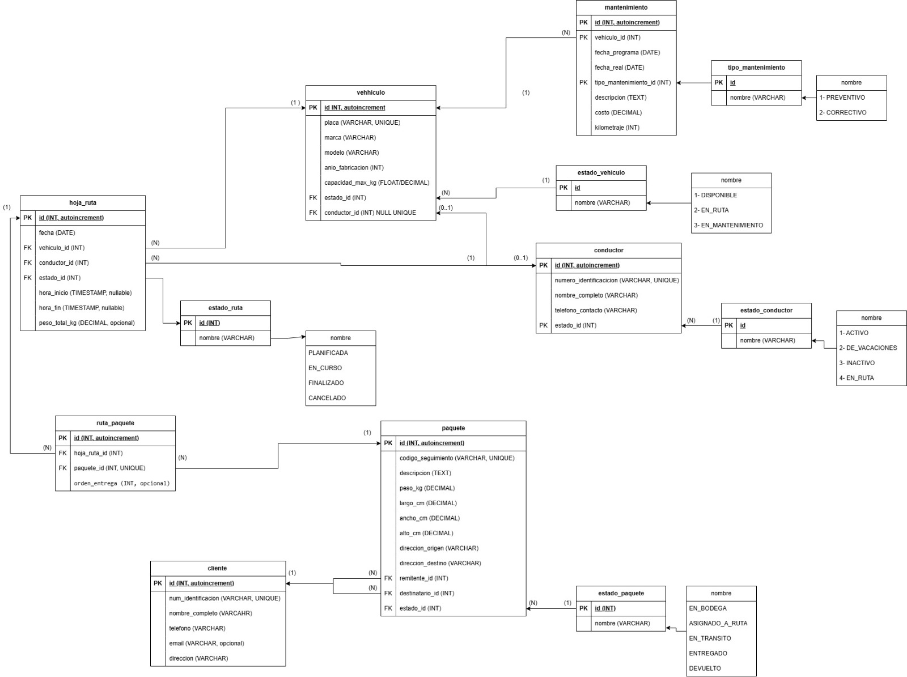

# Sistema de Gestión de Flotas y Rutas RapidExpress

Sistema de gestión logística desarrollado en Java con arquitectura MVC, interfaz de línea de comandos (CLI) y base de datos MySQL.

## Características Principales

- Gestión completa de vehículos, conductores, clientes y paquetes
- Planificación y seguimiento de rutas de entrega
- Sistema de mantenimiento de vehículos
- Generación de reportes y auditoría
- Sistema de autenticación con roles y permisos

## Sistema de Usuarios y Roles

El sistema implementa un control de acceso basado en roles (RBAC) con los siguientes roles:

### Roles Disponibles

1. **ADMINISTRADOR**
   - Acceso completo a todas las funcionalidades del sistema
   - Puede gestionar vehículos, conductores, clientes, paquetes y mantenimientos
   - Puede crear rutas y gestionar todas las operaciones
   - Acceso a reportes y auditoría

2. **OPERADOR_LOGISTICA**
   - Puede gestionar paquetes (registrar, actualizar)
   - Puede crear y gestionar rutas de entrega
   - Puede agregar paquetes a rutas
   - Puede iniciar y finalizar rutas
   - Acceso de solo lectura a vehículos, conductores y clientes

3. **CONDUCTOR**
   - Puede ver sus rutas asignadas
   - Puede ver sus rutas activas
   - Puede actualizar estados de paquetes en sus rutas
   - Acceso de solo lectura a información general

4. **AUDITOR**
   - Acceso de solo lectura a reportes
   - Acceso de solo lectura a auditoría
   - No puede realizar modificaciones en el sistema

### Usuarios de Prueba

El sistema incluye usuarios de ejemplo para cada rol. La contraseña por defecto para todos los usuarios es: `password123`

**Usuarios de ejemplo:**

- `admin` - Administrador del Sistema (ADMINISTRADOR)
- `operador1` a `operador5` - Operadores de Logística (OPERADOR_LOGISTICA)
- `conductor1` a `conductor10` - Conductores (CONDUCTOR)
- `auditor1` a `auditor6` - Auditores (AUDITOR)

**Total:** 22 usuarios (1 administrador, 5 operadores, 10 conductores, 6 auditores)

## Instalación

### Requisitos Previos

- Java JDK 8 o superior
- MySQL 8.0 o superior
- Maven 3.6 o superior

### Configuración de la Base de Datos

1. Crear la base de datos ejecutando el script DDL:

```bash
mysql -u root -p < database/1_schema_ddl.sql
```

2. Poblar la base de datos con datos de ejemplo:

```bash
mysql -u root -p proyecto_java < database/2_data_dml.sql
```

### Configuración de Conexión

Editar el archivo `src/main/java/com/rapidexpress/utils/ConexionBD.java` y ajustar las credenciales de conexión:

```java
private static final String URL = "jdbc:mysql://localhost:3306/proyecto_java?useSSL=false&serverTimezone=UTC&allowPublicKeyRetrieval=true";
private static final String USER = "root";
private static final String PASS = "tu_contraseña";
```

## Compilación y Ejecución

### Compilar el proyecto

```bash
mvn compile
```

O manualmente:

```bash
javac -cp "lib/*:target/classes" -d target/classes src/main/java/com/rapidexpress/**/*.java
```

### Ejecutar la aplicación

```bash
mvn exec:java -Dexec.mainClass="com.rapidexpress.Main"
```

O manualmente:

```bash
java -cp "target/classes:lib/*" com.rapidexpress.Main
```

## Uso del Sistema

Al iniciar la aplicación, se solicitará autenticación:

1. Ingrese su nombre de usuario
2. Ingrese su contraseña
3. El sistema mostrará el menú principal según los permisos de su rol

### Funcionalidades por Rol

#### Administrador
- Acceso completo a todos los módulos
- Puede realizar todas las operaciones CRUD

#### Operador de Logística
- Gestión de paquetes (crear, actualizar)
- Creación y gestión de rutas
- Visualización de información general

#### Conductor
- Ver sus rutas asignadas
- Ver sus rutas activas
- Actualizar estados de paquetes en sus rutas

#### Auditor
- Ver reportes del sistema
- Consultar registros de auditoría

## Estructura del Proyecto

```
ProyectoJava/
├── database/
│   ├── 1_schema_ddl.sql          # Script de creación de esquema
│   ├── 2_data_dml.sql             # Script de datos de ejemplo
│   └── diagrama_entidad_relacion.png
├── src/main/java/com/rapidexpress/
│   ├── Main.java                  # Clase principal con CLI
│   ├── dao/                       # Capa de acceso a datos
│   │   ├── ClienteDAO.java
│   │   ├── ConductorDAO.java
│   │   ├── HojaRutaDAO.java
│   │   ├── MantenimientoDAO.java
│   │   ├── PaqueteDAO.java
│   │   ├── RutaPaqueteDAO.java
│   │   ├── UsuarioDAO.java
│   │   └── VehiculoDAO.java
│   ├── model/entity/              # Entidades del modelo
│   │   ├── Cliente.java
│   │   ├── Conductor.java
│   │   ├── HojaRuta.java
│   │   ├── Mantenimiento.java
│   │   ├── Paquete.java
│   │   ├── Rol.java
│   │   ├── RutaPaquete.java
│   │   ├── Usuario.java
│   │   └── Vehiculo.java
│   ├── service/                   # Capa de servicios (Controladores)
│   │   ├── AuditoriaService.java
│   │   ├── AuthService.java       # Servicio de autenticación
│   │   ├── ReporteService.java
│   │   └── RutaService.java
│   └── utils/
│       └── ConexionBD.java        # Utilidad de conexión
├── logs/                          # Archivos de log
├── reportes/                      # Reportes generados
├── pom.xml                        # Configuración Maven
└── README.md                      # Este archivo
```

## Arquitectura MVC

- **Modelo**: Clases en `model/entity/` que representan las entidades del dominio
- **Vista**: Interfaz de línea de comandos en `Main.java`
- **Controlador**: Servicios en `service/` que contienen la lógica de negocio

## Base de Datos

El sistema utiliza MySQL con las siguientes tablas principales:

- `usuario` y `rol_usuario` - Sistema de autenticación
- `cliente` - Información de clientes
- `conductor` - Información de conductores
- `vehiculo` - Información de vehículos
- `paquete` - Información de paquetes
- `hoja_ruta` - Planificación de rutas
- `ruta_paquete` - Relación entre rutas y paquetes
- `mantenimiento` - Registro de mantenimientos
- `auditoria` - Registro de operaciones del sistema

### Diagrama de Entidad-Relación



El diagrama muestra la estructura completa de la base de datos con todas las entidades, sus atributos y las relaciones entre ellas. Incluye:

- **Entidades principales**: vehiculo, conductor, cliente, paquete, hoja_ruta
- **Entidades de estado**: estado_vehiculo, estado_conductor, estado_ruta, estado_paquete
- **Entidades de mantenimiento**: mantenimiento, tipo_mantenimiento
- **Relaciones**: ruta_paquete (tabla de unión entre rutas y paquetes)

## Seguridad

- Las contraseñas se almacenan usando hash MD5 (en producción se recomienda usar bcrypt o Argon2)
- El sistema valida permisos en cada operación
- Todas las operaciones se registran en la tabla de auditoría

## Notas Importantes

- Los códigos de seguimiento de paquetes se generan automáticamente con formato: `RE-YYYYMMDD-XXXX`
- El sistema crea automáticamente los directorios `logs/` y `reportes/` al iniciar
- Los triggers de la base de datos registran automáticamente cambios en vehículos, paquetes y rutas

## Autores

- Andres Felipe Mendoza Gomez
- Maria De Los Angeles Contreras
- Pamela Galvis Alvarez
